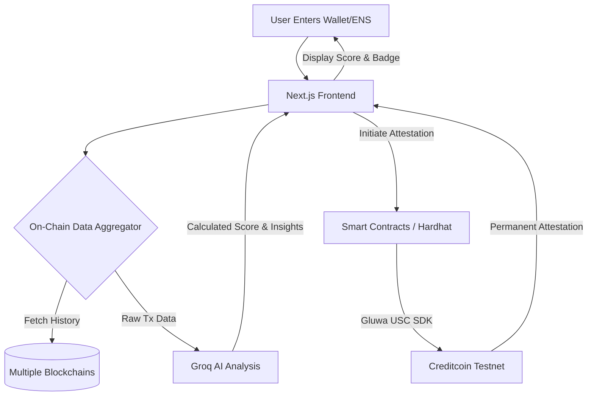

# LoanLens 🔍

**Your On-Chain Financial Identity. Verified & Trusted.**

Built for the BUIDL CTC 2026 Fall - BUIDL For The Real World

## 🚀 Overview

LoanLens is an omnichain credit scoring and identity attestation platform designed to bridge the gap between fragmented Web3 data and reliable lending protocols. By analyzing a user's on-chain history across multiple networks, LoanLens leverages AI to generate a comprehensive credit score. This identity is then zero-knowledge verifiable and permanently attested on the **Creditcoin** protocol using the **Gluwa USC SDK**.

### The Problem
In decentralized finance (DeFi), undercollateralized lending remains a massive hurdle. Users have rich financial histories across multiple blockchains—repaying loans, holding stable assets, and participating in DAOs—but there is no unified, privacy-preserving way to prove their reliability to lenders. Without a Web3 credit score, users are forced into highly overcollateralized positions.

### The Solution
LoanLens solves this by aggregating cross-chain transaction data and feeding it into a high-speed AI analysis engine (powered by **Groq**). It evaluates wallet age, transaction volume, asset stability, and past borrowing behavior to compute a robust credit score. To ensure trust without compromising privacy, this score is permanently minted as an **Attestcoin** on the **Creditcoin testnet** via the Gluwa USC SDK, acting as a universal, verifiable credential for DeFi protocols.

## 🏗️ Architecture



### Detailed Workflow
1. **Wallet Input & Aggregation:** The user provides a wallet address (or ENS) on our interactive, glassmorphism-styled dashboard. The backend immediately aggregates transaction history, loan repayment data, and asset holdings across supported chains using Ethers.js.
2. **AI Credit Scoring:** The raw blockchain data is securely passed to the Groq SDK. Leveraging high-speed LLM profiling, it analyzes the data points for financial reliability (e.g., lack of liquidations, consistent interactions with blue-chip DeFi protocols) and calculates a final credit score from 300 to 850.
3. **On-Chain Attestation:** Once the score is generated, the system uses the Gluwa USC SDK combined with OpenZeppelin smart contracts to mint an immutable credential (Attestcoin) directly onto the Creditcoin testnet.
4. **Universal Verification:** The resulting zero-knowledge credential can be read by other smart contracts and protocols, projecting a trusted omnichain identity without exposing the user's raw financial data.

## 💻 Tech Stack
- **Frontend:** Next.js (App Router), React 19, Tailwind CSS v4, Framer Motion for micro-animations, Recharts for data visualization.
- **Blockchain / Web3:** Ethers.js, Hardhat for local testing and deployment, OpenZeppelin Contracts, Gluwa USC SDK, Creditcoin Testnet.
- **AI Analytics:** Groq SDK for ultra-fast, LLM-based transaction profiling and score generation.

## 🛠️ Setup & Installation

1. **Clone the repository:**
   ```bash
   git clone <your-repo-url>
   cd LoanLens
   ```

2. **Install dependencies:**
   ```bash
   npm install
   ```

3. **Environment Variables:**
   Create a `.env` file in the root directory:
   ```env
   GROQ_API_KEY="your-groq-api-key"
   CREDITCOIN_RPC_URL="your-rpc-url"
   PRIVATE_KEY="your-wallet-private-key"
   ```

4. **Compile Smart Contracts:**
   ```bash
   npx hardhat compile
   ```

5. **Run the Application:**
   ```bash
   npm run dev
   ```
   Navigate to `http://localhost:3000` to view the application.

---
*Built with ❤️ for BUIDL CTC 2026 Fall - BUIDL For The Real World.*
