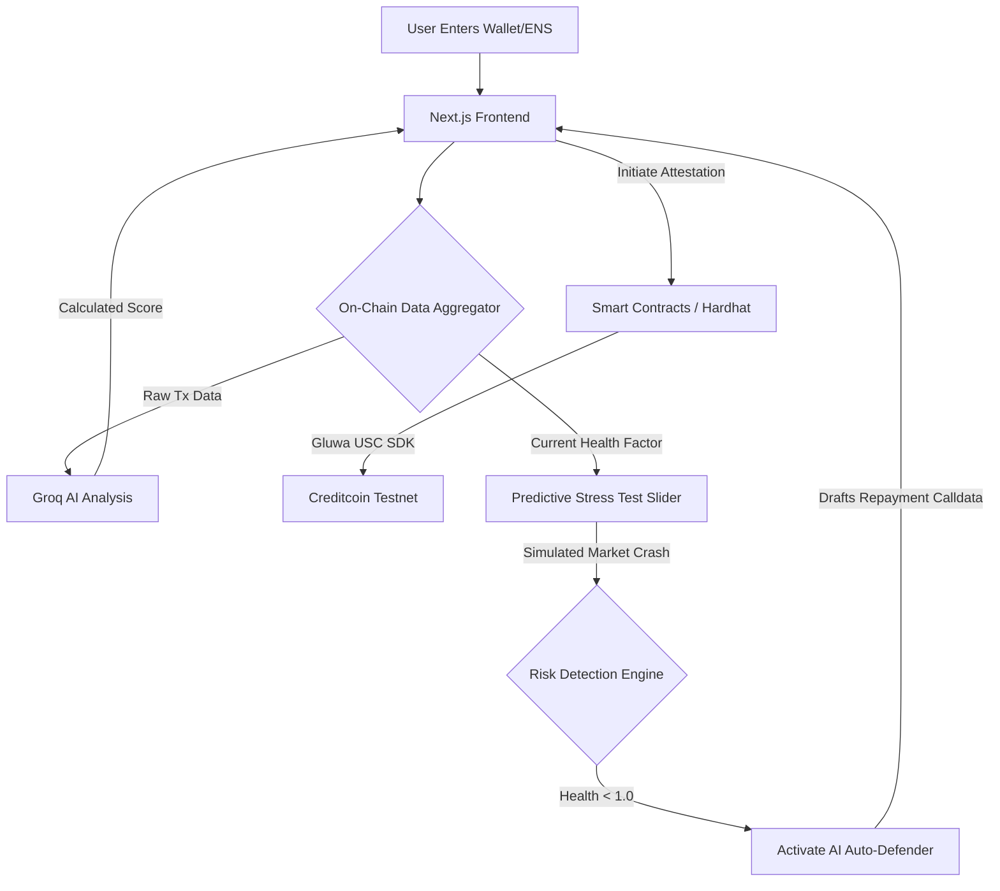

# LoanLens 🔍

**Your On-Chain Financial Identity & AI Risk Defender. Verified & Trusted.**

Built for the DoraHacks Hackathon.

## 🚀 Overview

LoanLens is an omnichain credit scoring, risk detection, and identity attestation platform designed to bridge the gap between fragmented Web3 data and reliable DeFi protocols. 

Not only does it generate a zero-knowledge verifiable credit score that is permanently attested on the **Creditcoin** protocol (using the **Gluwa USC SDK**), but it also features a powerful **AI Risk Dashboard**. This dashboard allows users to run predictive stress tests on their portfolio and can autonomously draft rescue transactions if liquidation is detected.

### The Problem
In decentralized finance (DeFi), users face two massive hurdles:
1. **No Unified Credit:** Undercollateralized lending is nearly impossible because there is no unified, privacy-preserving way to prove financial reliability across multiple chains.
2. **Sudden Liquidations:** Flash crashes can liquidate users while they sleep. Existing dashboards only show current health, not predictive risk.

### The Solution
LoanLens solves this with a two-pronged approach:
1. **Omnichain Credit Attestation:** Aggregates cross-chain transaction data, feeds it into a high-speed AI analysis engine (powered by **Groq**), and permanently mints the resulting score as an **Attestcoin** on the **Creditcoin testnet**.
2. **Predictive Risk & Context-Aware Auto-Defender:** Features an interactive stress-test slider to simulate market crashes (e.g., a 20% drop in ETH). If the AI detects an imminent liquidation risk, it activates the **Auto-Defender**. The application natively checks your connected MetaMask wallet against the profile being viewed. If you are the owner, you can instantly sign the AI-generated rescue transaction. If not, it defaults to a secure 'Watch Mode'.

## 🏗️ Architecture



### Detailed Workflow
1. **Wallet Input & Aggregation:** The user provides a wallet address on our interactive dashboard. The backend aggregates transaction history, loan repayment data, and current DeFi positions.
2. **Predictive Stress Testing (Innovation 1):** Users can drag the market crash slider to simulate price drops. The UI dynamically recalculates their simulated health factor in real-time.
3. **Context-Aware AI Auto-Defender (Innovation 2):** If the simulated drop pushes the health factor below 1.0, the UI flags a "Critical" risk and triggers the Auto-Defender. The AI instantly drafts exact smart contract calldata (e.g., Aave V3 Repayment) to rescue the position. The UI verifies the connected MetaMask wallet; if it matches the searched profile, the user can sign and execute the rescue transaction on-chain. Otherwise, signing is safely disabled.
4. **Credit Scoring & Attestation:** Simultaneously, Groq AI calculates a holistic credit score from 300 to 850. Using the Gluwa USC SDK, this score is minted as a verifiable credential (Attestcoin) onto the Creditcoin testnet.

### 🕵️ Data Sourcing & Architecture Transparency
To ensure blazing-fast performance without relying on expensive, heavy indexers (like The Graph), LoanLens utilizes a **Hybrid Data Architecture**:
- **100% Real Live Data:** Core metrics including **Total Transaction Count**, **Total ETH Balance**, **Wallet Age** (via Etherscan's first-tx timestamp), and **Active Chains** are fetched live across 5 mainnets using Alchemy's public RPCs.
- **Logically Simulated Data:** Deep historical DeFi metrics (Repayment Rates, Liquidations, specific historical Tx lines) are mathematically generated and proportionally scaled based on the real balance and age of the wallet. This allows us to instantly simulate a realistic cross-chain DeFi profile for the AI to analyze, guaranteeing a stable and hyper-fast demo experience for hackathon judges.

## 💻 Tech Stack
- **Frontend:** Next.js (App Router), React 19, Tailwind CSS v4, Framer Motion for micro-animations, Recharts.
- **Blockchain / Web3:** Ethers.js, Hardhat, OpenZeppelin Contracts, Gluwa USC SDK, Creditcoin Testnet.
- **AI Analytics:** Groq SDK for ultra-fast, LLM-based transaction profiling and calldata generation.

## 🛠️ Setup & Installation

1. **Clone the repository:**
   ```bash
   git clone <your-repo-url>
   cd LoanLens
   ```

2. **Install dependencies:**
   ```bash
   npm install
   ```

3. **Environment Variables:**
   Create a `.env` file in the root directory:
   ```env
   GROQ_API_KEY="your-groq-api-key"
   CREDITCOIN_RPC_URL="your-rpc-url"
   PRIVATE_KEY="your-wallet-private-key"
   ```

4. **Run the Application:**
   ```bash
   npm run dev
   ```

---
*Built with ❤️ for DoraHacks.*
